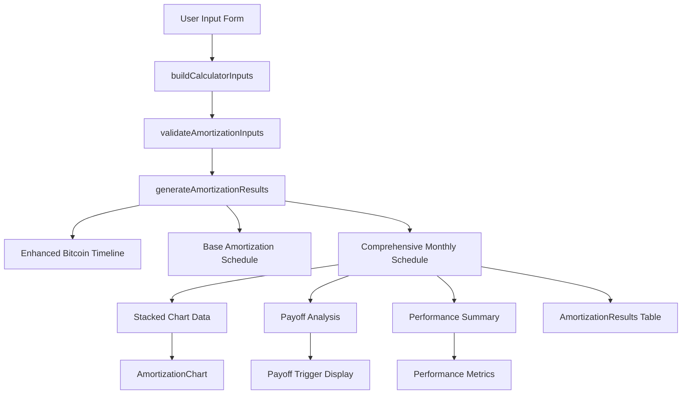

# Data Flow Map

## Primary Data Pipeline

### Input → Calculation → Output Flow



## Detailed Component Data Flow

### 1. Input Collection (CalculatorForm.tsx)

#### Form State → CalculatorInputs Mapping
```typescript
// Property Data
propertyValue → property.currentValue
propertyAppreciationRate → property.appreciationRate

// Current Mortgage
currentBalance → currentMortgage.currentBalance
monthlyPayment → currentMortgage.monthlyPayment
currentInterestRate → currentMortgage.interestRate
remainingYears → currentMortgage.remainingYears

// Property Income
monthlyRentalIncome → propertyIncome.monthlyRentalIncome
monthlyTaxes → propertyIncome.monthlyTaxes
monthlyInsurance → propertyIncome.monthlyInsurance
monthlyHOA → propertyIncome.monthlyHOA
netMonthlyCashFlow → propertyIncome.netMonthlyCashFlow

// Refinance Scenario
cashOutAmount → refinanceScenario.cashOutAmount
newLoanTermYears → refinanceScenario.newLoanTermYears
newInterestRate → refinanceScenario.newInterestRate
closingCosts → refinanceScenario.closingCosts

// Bitcoin Investment
cashOutAmount → bitcoinInvestment.investmentAmount
currentBitcoinPrice → bitcoinInvestment.currentBitcoinPrice
getSentimentPercentage() → performanceSettings.initialCAGR
bitcoinPerformanceModel === 'cycles' → performanceSettings.useSeasonalFactors
bitcoinDrawdownPercent → performanceSettings.maxDrawdownPercent
new Date() (first day of current month) → performanceSettings.loanStartDate

// Payoff Trigger
payoffTriggerType → payoffTrigger.type
payoffTriggerValue → payoffTrigger.value
```

### 2. Validation Layer

#### validateAmortizationInputs(inputs)
```typescript
Input: CalculatorInputs
Validation Rules:
├── property.currentValue > 0
├── bitcoinInvestment.investmentAmount > 0
├── bitcoinInvestment.currentBitcoinPrice > 0
├── payoffTrigger.value > 0
└── payoffTrigger.type === 'percentage' ? value ≤ 1000 : true

Output: { isValid: boolean; errors: string[] }
```

### 3. Enhanced Bitcoin Algorithm

#### generateEnhancedBitcoinPerformanceTimeline(inputs, maxMonths)
```typescript
Input: CalculatorInputs + maxMonths
Process:
├── Extract loan term: refinanceScenario.newLoanTermYears * 12
├── Calculate total cycles: Math.ceil(loanTermMonths / 48)
├── Get loan start date: performanceSettings.loanStartDate
├── Get initial cycle position: getLoanStartCyclePosition(loanStartDate)
└── Generate monthly performance data

For each month (0 to loanTermMonths):
├── Calculate absolute cycle position: initialCyclePosition + month
├── Get current cycle: Math.floor(absoluteMonthInGlobalCycle / 48) + 1
├── Get cycle position: absoluteMonthInGlobalCycle % 48
├── Calculate cycle CAGR: calculateCycleCAGR(currentCycle, totalCycles, initialCAGR, finalCAGR)
├── Calculate seasonal factors: calculateSeasonalFactors(cycleCAGR)
├── Get monthly factor: getMonthlyPerformanceFactor(cyclePosition, seasonalFactors)
├── Calculate performance rate: month === 0 ? 0 : (monthlyFactor - 1)
└── Get season info: getCurrentSeason(cyclePosition)

Output: BitcoinPerformanceData[]
```

#### calculateEnhancedBitcoinValueAtMonth(month, initialInvestment, initialPrice, performanceTimeline)
```typescript
Input: month + investment data + performance timeline
Process:
├── If month === 0: return initial values
├── Start with currentPrice = initialPrice
├── For each month 1 to current month:
│   ├── Get monthData = performanceTimeline[i - 1]
│   ├── Apply growth factor: 1 + monthData.monthlyPerformanceRate
│   ├── Update currentPrice *= growthFactor
│   └── Apply safety bounds: max 20% monthly drop
└── Calculate final values

Output: { totalValue, bitcoinHeld, averagePrice, currentSpotPrice }
```

### 4. Comprehensive Amortization Engine

#### generateComprehensiveAmortizationTable(inputs, maxMonths)
```typescript
Input: CalculatorInputs + maxMonths
Process:
├── Get loan term: maxMonths || (refinanceScenario.newLoanTermYears * 12)
├── Generate base schedule: createBaseAmortizationSchedule(inputs, loanTermMonths)
├── Generate Bitcoin timeline: generateEnhancedBitcoinPerformanceTimeline(inputs, loanTermMonths)
├── Initialize Bitcoin tracking variables
└── Combine data for each month

For each month (0 to schedule length):
├── Get base entry: baseSchedule[i]
├── Get BTC performance: bitcoinPerformance[i]
├── Calculate BTC value: calculateEnhancedBitcoinValueAtMonth(i, ...)
├── Calculate cash flow shortfall: expenses - rental income
├── Calculate BTC sales: calculateBTCSalesForShortfall(shortfall, spotPrice, remainingBTC)
├── Update BTC holdings: remainingBTC = btcSales.remainingBTC
├── Calculate total asset value: propertyValue + btcValue
├── Check payoff trigger: checkPayoffTrigger(btcValue, debtBalance, payoffTrigger)
└── Create comprehensive entry

Output: MonthlyAmortizationEntry[]
```

#### generateStackedChartData(amortizationSchedule, property)
```typescript
Input: MonthlyAmortizationEntry[] + property data
Process:
├── Limit to 240 months (20 years) for visualization
└── Transform each entry to chart data point

For each entry (up to maxMonths):
├── month: entry.month
├── date: entry.date
├── debt: entry.debtBalance
├── baseEquity: property.currentValue - entry.debtBalance
├── appreciation: entry.propertyAppreciation
├── btcValue: entry.btcValue
└── totalValue: entry.totalAsset

Output: StackedChartDataPoint[]
```

### 5. Results Package Assembly

#### generateAmortizationResults(inputs, maxMonths)
```typescript
Input: CalculatorInputs + maxMonths (default 360)
Process:
├── monthlySchedule = generateComprehensiveAmortizationTable(inputs, maxMonths)
├── stackedChartData = generateStackedChartData(monthlySchedule, inputs.property)
├── payoffAnalysis = analyzePayoffTrigger(monthlySchedule)
└── performanceSummary = calculatePerformanceSummary(monthlySchedule, inputs)

Output: AmortizationResults {
  monthlySchedule,
  stackedChartData,
  payoffAnalysis,
  performanceSummary
}
```

## Component Integration Data Flow

### Main Page (app/page.tsx)

#### State Management Flow
```typescript
Initial State:
├── amortizationResults: null
├── calculating: false
└── error: null

User Interaction Flow:
1. User submits form → handleCalculation(inputs)
2. Set calculating: true, error: null
3. Call generateAmortizationResults(inputs)
4. Set amortizationResults: results
5. Set calculating: false

Component Props Flow:
├── CalculatorForm: realChartData={amortizationResults?.stackedChartData}
└── AmortizationResults: results={amortizationResults}
```

### Calculator Form Auto-Calculation
```typescript
useEffect Dependencies:
├── propertyValue, currentBalance, monthlyPayment
├── currentInterestRate, cashOutAmount, newInterestRate
├── bitcoinPerformanceModel, bitcoinPerformanceSentiment
├── propertyAppreciationRate, currentBitcoinPrice
└── All other form fields

Trigger Conditions:
├── hasMinimumData: required fields have values
├── hasValidBitcoinPrice: currentBitcoinPrice !== 100000
└── validation.isValid: inputs pass validation

Auto-Calculation Flow:
1. Form field changes → useEffect triggered
2. Check trigger conditions
3. If conditions met: buildCalculatorInputs() → onSubmit(inputs)
4. Main page receives inputs → runs calculation
5. Results flow back to form → chart updates
```

### Chart Data Integration
```typescript
Chart Data Source Priority:
1. realChartData (from amortizationResults.stackedChartData) ← PRIMARY
2. generateSampleChartData() ← FALLBACK ONLY

Data Flow:
AmortizationResults.stackedChartData → Main Page → CalculatorForm.realChartData → AmortizationChart.data

Chart Rendering:
├── Data transformation: StackedChartDataPoint[] → Recharts format
├── Y-axis calculation: calculateYAxisMax() for visibility
├── Halving lines: generateHalvingLines() from data date range
├── Tooltip: CustomTooltip with currency formatting
└── Layers: Debt (red) → Base Equity (green) → Appreciation (light green) → BTC Value (orange)
```

## External Data Integration

### Bitcoin Price API Flow
```typescript
CoinGecko API Integration:
1. Component mount → fetchCurrentBitcoinPrice()
2. API call: https://api.coingecko.com/api/v3/simple/price?ids=bitcoin&vs_currencies=usd
3. Success: setCurrentBitcoinPrice(data.bitcoin.usd)
4. Error: Keep default (100000) - triggers fallback behavior
5. Price used in: bitcoinInvestment.currentBitcoinPrice
```

### Date/Time Flow
```typescript
Timeline Foundation:
├── Last halving: April 20, 2024 (from BITCOIN_HALVINGS)
├── Today: Dynamic (new Date() from environment)
├── Loan start: First day of current month (performanceSettings.loanStartDate)
└── Current cycle position: Calculated dynamically from current date

Date Progression:
├── Month 1: First day of current month
├── Month 2: First day of following month
├── Month N: addMonths(loanStartDate, N-1)
└── Date format: YYYY-MM-DD for consistency
```

## Error Propagation Flow

### Error Handling Chain
```typescript
Input Validation Errors:
Form validation → setErrors() → Display in UI

API Errors:
fetchCurrentBitcoinPrice() → catch → console.error → keep default price

Calculation Errors:
handleCalculation() → try/catch → setError() → Display in AmortizationResults

NaN Prevention:
Enhanced algorithm → safety checks → prevent NaN propagation
```

### Data Validation Checkpoints
```typescript
1. Form Input Level:
   ├── Required field validation
   ├── Number format validation
   └── Range validation

2. CalculatorInputs Level:
   ├── validateAmortizationInputs()
   ├── Business logic validation
   └── Cross-field validation

3. Calculation Level:
   ├── NaN checks in enhanced algorithm
   ├── Safety bounds in price calculations
   └── Division by zero prevention

4. Display Level:
   ├── Currency formatting with fallbacks
   ├── Percentage formatting with bounds
   └── Date formatting with validation
```

## Performance Data Flow

### Calculation Performance
```typescript
Optimization Points:
├── Loan term limiting: Max 360 months
├── Chart data limiting: Max 240 months
├── Auto-calculation debouncing: useEffect dependencies
└── Memo/caching: None currently (could be added)

Memory Flow:
├── Input collection: Form state (lightweight)
├── Calculation: Arrays bounded by loan term
├── Results: Complete data structure
└── Cleanup: Results cleared on new calculation
```

### Re-render Optimization
```typescript
State Changes Triggering Re-renders:
├── Form field changes → Auto-calculation → Results update → Chart/table re-render
├── Bitcoin price fetch → Form update → Auto-calculation if conditions met
├── Calculation status → Loading states → UI updates
└── Error states → Error display updates

Potential Optimizations:
├── useMemo for expensive calculations
├── useCallback for stable function references
├── React.memo for pure components
└── State structure optimization
```

---

*Data Flow Map - Version 1.0*  
*Last Updated: Dynamic date system implementation*  
*Traces complete data pipeline from user input to visualization*